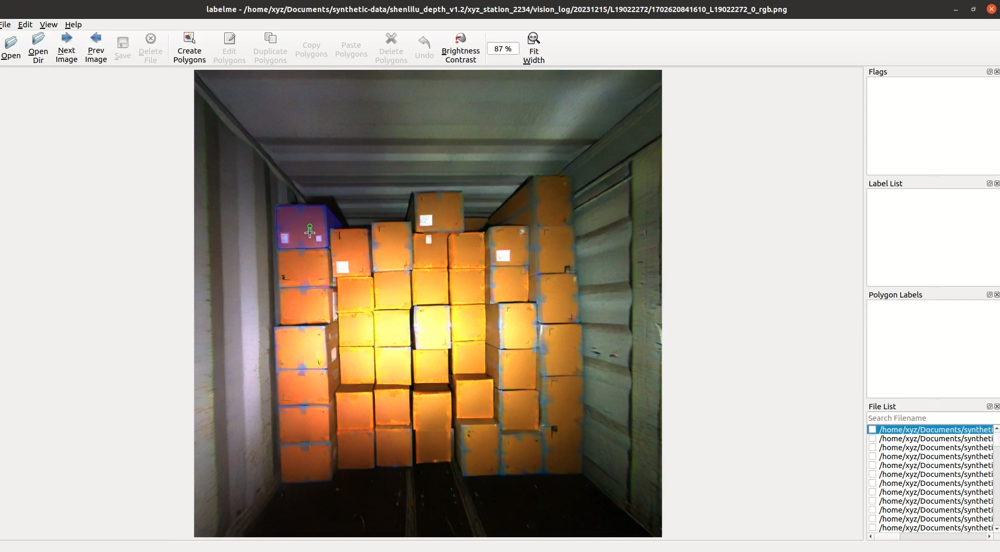
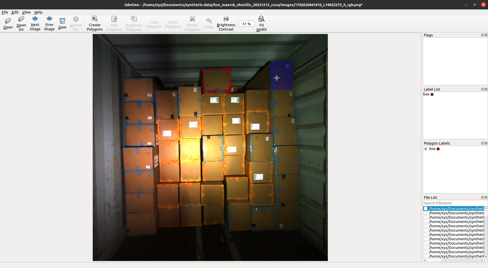

# Lightning Segment-Anything Model with Point Prompt

This project is fork from lightning-sam, and I am trying to let it support point prompt in training.

## Status
Point prompt training is implemented by using the center of bounding-box as prompt point.  
Only one positive prompt point is used.  
### Demo
I test the finetuned model using labelme-sam.  
I wants to label box with each plane as an instances while original SAM model will generate mask for entire box.  

After finetune, model is able to generate mask for box plane in default.

## TODO
- [x] Support point prompt training (Only center of box).
- [ ] Support random selected point prompt.
- [ ] Support mixed prompt training. 